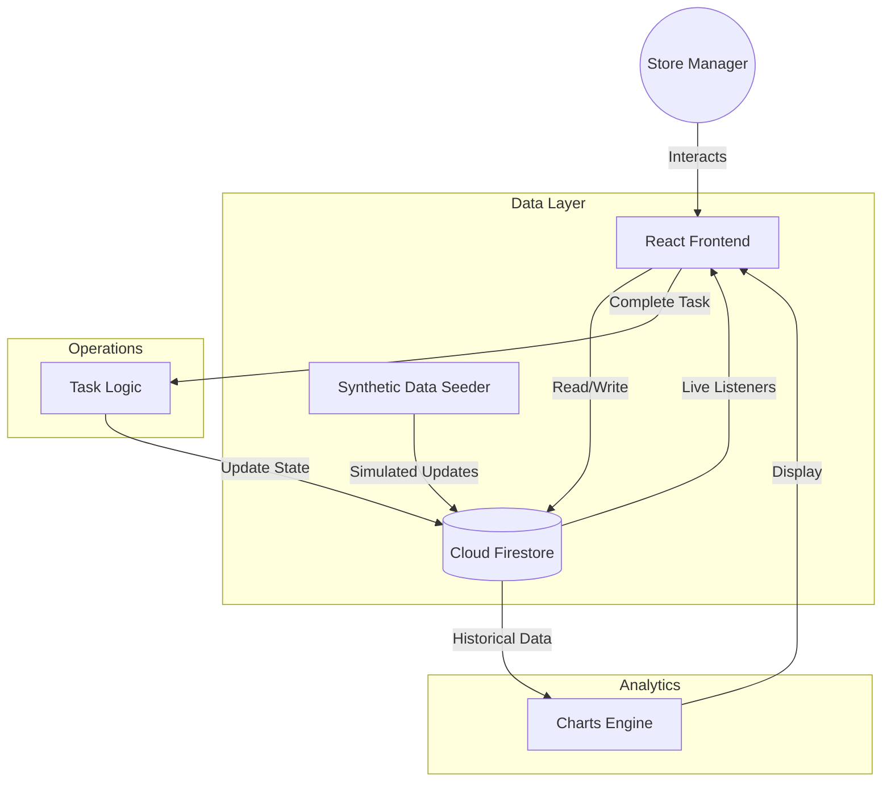

# Application Architecture: Store Copilot

## Overview
Store Copilot is a real-time, AI-augmented retail operations dashboard. It integrates inventory management, executive analytics, and live store operations into a single cohesive interface.

## Tech Stack
- **Frontend**: React (Vite) + Tailwind CSS + Lucide Icons + Framer Motion (Animations)
- **Backend / Database**: Google Firebase (Firestore) for real-time state synchronization
- **Styling**: Tailwind CSS with a "Glassmorphism" custom recipe for high-end UI/UX

## Core Components
1. **Executive Dashboard**: High-level financial metrics and performance trends using Recharts.
2. **Merchant Workbench**: Inventory health monitoring and stock-level optimization.
3. **Store Operations**: Real-time floor management, occupancy tracking, and task execution.
4. **Data Engine**: A synthetic data seeder and real-time simulator that pushes updates to Firebase every few seconds to demonstrate "live" data flow.

## Data Flow Diagram

## Security Model
- **Authentication**: Firebase Authentication (Google Login).
- **Authorization**: Hardened Firestore Security Rules (Attribute-Based Access Control) ensuring users can only modify their assigned store data.

## Key Features
- **Real-time Synchronization**: Changes made in one session reflect instantly across all connected clients.
- **Dynamic Capacity Management**: System monitors "Data Capacity" which scales based on task throughput and system load.
- **Responsive Design**: Designed for both large-screen store terminals and mobile tablets.
